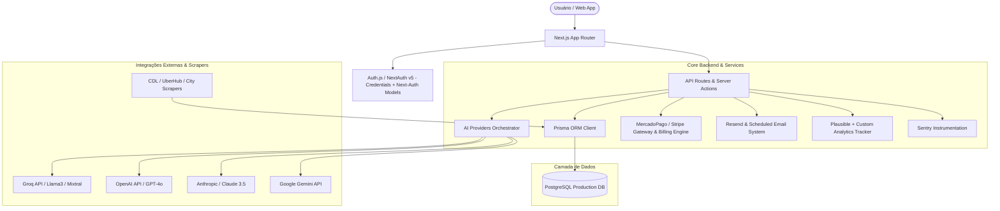

# Documentação Completa da Arquitetura e Ecossistema do CarreirasMatch

Este documento apresenta o panorama arquitetural completo do **CarreirasMatch**, detalhando a infraestrutura existente, modelos de dados, rotas, provedores de IA, fluxos de monetização, agendadores de tarefas, ferramentas e instrumentação, servindo como a fonte principal da verdade para evitar duplicações e orientar evoluções futuras.

---

## 1. Visão Geral da Arquitetura

O CarreirasMatch é uma plataforma full-stack moderna construída em **Next.js (App Router)** com **TypeScript**, utilizando **Prisma ORM** e banco de dados **PostgreSQL** em produção (com suporte a SQLite local em ambiente de dev/testes).



---

## 2. Tecnologias e Dependências Principais

- **Framework Web**: Next.js 15+ (App Router, Server Components & Server Actions)
- **Linguagem**: TypeScript
- **Estilização**: TailwindCSS + CSS Variables com Shadcn/UI primitives
- **Autenticação**: NextAuth / Auth.js (Support a credenciais e JWT)
- **Persistência**: Prisma ORM v6 (`src/generated/prisma`)
- **Provedores de IA**: Groq SDK, OpenAI SDK, Anthropic SDK, Google Generative AI
- **Pagamentos**: MercadoPago SDK & Stripe API com Webhooks
- **Disparo de E-mails**: Resend API
- **Analytics & Observabilidade**: Plausible Analytics, Sentry (`@sentry/nextjs`)
- **Testes**: Vitest (`vitest.config.ts`)

---

## 3. Modelo de Dados (Prisma Schema Overview)

A base de dados conta com um esquema abrangente (1.350+ linhas no `schema.prisma`), cobrindo os seguintes domínios:

### A. Usuários e Autenticação
- `User`: Cadastro base, perfil profissional, segmento de carreira (`careerSegment`), cidade/estado, preferências, badges e créditos de diagnóstico.
- `Account`, `Session`, `VerificationToken`, `PasswordResetToken`: Gerenciamento de sessão e segurança.

### B. Análise e Currículos
- `Resume`: Armazena texto extraído (`rawText`), binários em PDF (`pdfData`) e histórico de versões.
- `Analysis`: O coração da análise de match! Armazena:
  - Scores: `overallScore`, `technicalScore`, `experienceScore`, `seniorityScore`, `atsScore`.
  - Diagnóstico: `keywordsFound`, `keywordsMissing`, `strengths`, `weaknesses`, `fixes`, `interviewQuestions`, `studyPlan`, `recruiterMessage`.
  - Adaptabilidade: Campos específicos para transição de carreira, recolocação e primeiro emprego.

### C. Candidaturas e Metas
- `Application`: Registro de candidatura vinculada a `Resume`, `Analysis` e status (Aplicada, Entrevista, Proposta, etc.).
- `WeeklyGoal`: Metas semanais de candidaturas e progresso de hábitos.

### D. Monetização, Cupons e Influenciadores
- `Payment` & `Subscription`: Registro de transações, status de pagamento, assinaturas recorrentes e webhooks.
- `Coupon`: Sistema de cupons com dono (`InfluencerCoupon`), acompanhamento de cliques, conversões, comissão e cupons de cadastro (`signupCoupon`).

### E. Módulo B2B / Empresa
- `Company`, `CompanyVaga`, `CompanyJobApplication`, `TalentContactRequest`: Triagem de candidaturas por requisitos e triagem de talentos.

### F. Marketplace Freelancer
- `FreelancerProfile`, `FreelanceProject`, `FreelanceProposal`, `FreelanceContract`, `FreelanceReview`: Ecossistema completo para contratação freelancer integrada.

---

## 4. Estrutura de Diretórios do Projeto (`src/`)

```
src/
├── app/                      # Rotas Next.js App Router (68+ rotas)
│   ├── analise/              # Upload e resultado de análise de currículo x vaga
│   ├── applications/         # Gerenciamento de candidaturas do usuário
│   ├── assinar/              # Checkout e tabela de planos
│   ├── dashboard/            # Painel do candidato / rotina
│   ├── admin/                # Dashboard administrativo, métricas e funil
│   ├── empresa/ & empresas/  # Portal B2B de contratação e publicação de vagas
│   ├── estagio/, recolocacao/, transicao/ # Landings segmentadas
│   ├── api/                  # Endpoints REST e Webhooks (pagamentos, ai, auth)
│   └── tools/                # Ferramentas gratuitas (gerador de currículo, simuladores)
├── components/               # Componentes de UI reusáveis, modais e layouts
├── lib/                      # Lógica de negócio, clientes de API e utilitários
│   ├── ai-providers.ts       # Orquestrador multi-provider de Inteligência Artificial
│   ├── ai-schemas.ts         # Schemas Zod para parsing estruturado de IA
│   ├── analytics.ts          # Utilitário de tracking de eventos (Plausible + Custom)
│   ├── billing-plans.ts      # Definições de planos e assinaturas
│   ├── pricing.ts            # Tabela central de preços
│   ├── sentry-init.ts        # Inicializador Sentry
│   └── ... (mais de 140 utilitários para ATS, cupons, scrapers, etc.)
└── generated/                # Cliente compilado do Prisma ORM
```

---

## 5. Fluxos Principais

### A. Fluxo de Análise de Currículo × Vaga
1. **Upload / Entrada**: Usuário envia PDF ou texto do currículo + texto da vaga.
2. **Orquestração de IA (`lib/ai-providers.ts`)**: Tenta Groq com fallback transparente para OpenAI / Gemini / Anthropic.
3. **Parse de Schema (`lib/ai-schemas.ts`)**: Valida o retorno da IA garantindo estruturas JSON sem alucinações.
4. **Armazenamento**: Salva em `Resume` e cria uma instância de `Analysis`.
5. **Resultado / Teaser**: Exibe o score inicial e direciona para o diagnótico completo (P1 do novo plano adicionará maior clareza na microvitória).

### B. Fluxo de Monetização & Webhooks
1. **Checkout**: Usuário escolhe plano ou diagnóstico único (`/assinar`).
2. **Integração MercadoPago / Stripe**: Gera QR Code PIX / Preference ID.
3. **Webhook (`/api/webhooks/mercadopago`)**: Recebe o evento de pagamento, valida assinatura via webhook secret, atualiza status do `Payment` e libera privilégios (`Subscription` / `Entitlements`).

---

## 6. Diretrizes para Desenvolvimento Sem Duplicação

Ao implementar novas funcionalidades do plano de melhorias:
1. **Reutilize `lib/analytics.ts`**: Adicione novos nomes de evento na tipagem existente sem criar novos arquivos de tracking.
2. **Reutilize `lib/pricing.ts` / `lib/billing-plans.ts`**: Centralize novos preços e promoções nessa estrutura.
3. **Reutilize `lib/ai-providers.ts`**: Utilize o orquestrador já configurado para qualquer nova chamada de IA.
4. **Reutilize Prisma Schemas**: Aproveite os campos existentes em `Analysis`, `User` e `Application` antes de criar migrações desnecessárias.
