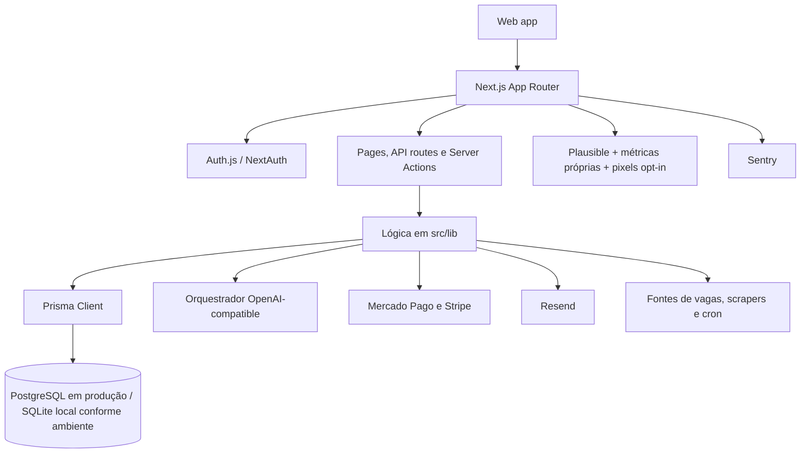

# Arquitetura e ecossistema do CarreirasMatch

Documento técnico revisado em 26/07/2026. A implementação atual usa Next.js
16.2.10, React 19.2.4, TypeScript, Prisma 7.9 e App Router.

## Visão geral

## Stack confirmada

- **Aplicação:** Next.js 16.2.10, React 19.2.4 e TypeScript.
- **Persistência:** Prisma 7.9; o schema tem 1.356 linhas. PostgreSQL é o
  destino de produção; há suporte a SQLite em fluxos locais/testes.
- **Autenticação:** Auth.js/NextAuth com proteção central em `src/proxy.ts` e
  configuração em `src/auth.config.ts`.
- **IA:** `src/lib/ai-providers.ts` usa o SDK da OpenAI para endpoints
  compatíveis. Pode distribuir/fazer fallback entre Groq, Cerebras, Gemini,
  OpenAI, Together, DeepInfra e OpenRouter quando as respectivas chaves estão
  configuradas.
- **Pagamentos:** Mercado Pago para pagamentos e assinaturas, com webhook em
  `/api/billing/webhook`; Stripe possui checkout e webhook complementares.
- **E-mail:** Resend, com deduplicação por `EmailLog` nos fluxos aplicáveis.
- **Observabilidade:** métricas próprias/Prometheus, Sentry, Grafana, Loki e
  Plausible quando habilitado.
- **Testes:** Vitest; a quantidade e o resultado devem ser obtidos executando
  `npm test`, não assumidos a partir de um número fixo no documento.

## Domínios funcionais

O sistema cobre análise currículo × vaga, ATS, currículos e exportações,
candidaturas, entrevistas, planos de ação, feed/radar de oportunidades,
alertas, segmentos de carreira, ferramentas de estudo, ensino médio,
gamificação, suporte, pagamentos, portal de empresas, parceiros e marketplace
freelancer.

As páginas principais estão em `src/app`; a API correspondente está em
`src/app/api`; regras reutilizáveis ficam em `src/lib`; o modelo completo está
em `prisma/schema.prisma`.

## Fluxos críticos

1. O candidato informa currículo e vaga em `/analise` ou usa o `/desafio`.
2. A aplicação chama o orquestrador de IA, valida a resposta estruturada e
   persiste currículo/análise.
3. O usuário recebe score, lacunas, recomendações, perguntas e próximos
   passos; pode acompanhar candidaturas e entrevistas.
4. Pagamentos avulsos e assinaturas passam por Mercado Pago ou Stripe. O
   webhook confirma o pagamento, atualiza `Payment`/`Subscription` e libera o
   acesso correspondente.
5. Empresas publicam vagas, fazem triagens e pesquisam talentos; parceiros
   publicam cursos e o marketplace conecta freelancers a projetos.

## Princípios para novas mudanças

- Reutilizar os módulos existentes de IA, billing, analytics e autenticação.
- Confirmar rota, acesso e persistência no código antes de criar documentação.
- Não prometer candidatura automática em qualquer site: o piloto automático
  respeita regras, autorização, login e CAPTCHA das fontes externas.
